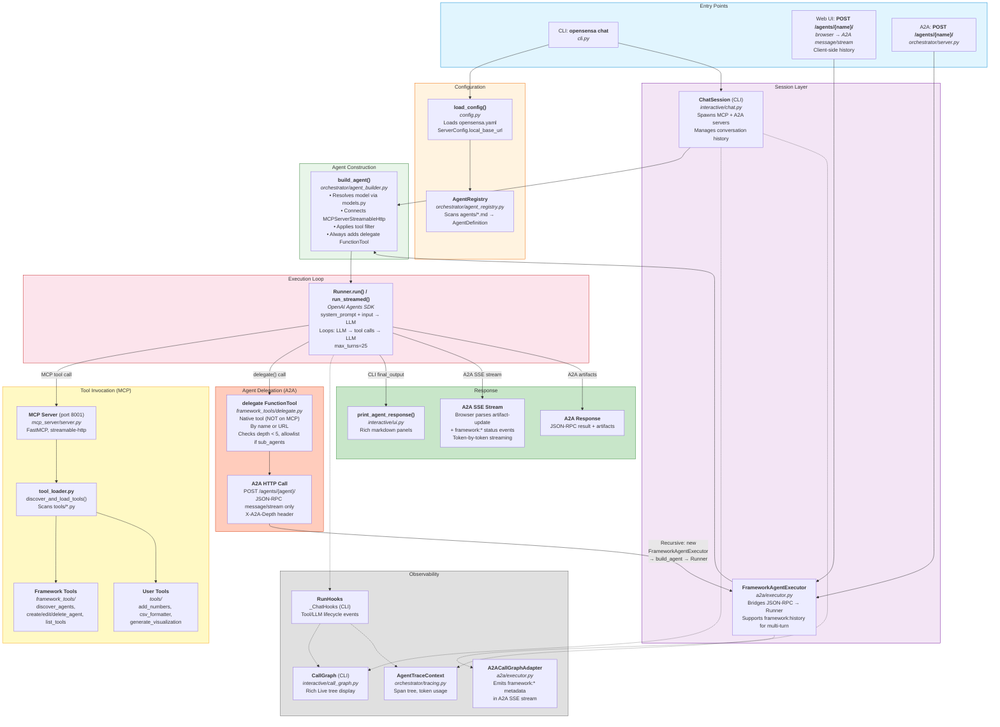

# OpenSensa Architecture

```mermaid
flowchart TD
    subgraph Entry["Entry Points"]
        CLI["CLI: <b>opensensa chat</b><br/><i>cli.py</i>"]
        WEB["Web UI: <b>POST /agents/{name}/</b><br/><i>browser → A2A message/stream</i><br/>Client-side history"]
        A2A["A2A: <b>POST /agents/{name}/</b><br/><i>orchestrator/server.py</i>"]
    end

    subgraph Config["Configuration"]
        CFG["<b>load_config()</b><br/><i>config.py</i><br/>Loads opensensa.yaml<br/>ServerConfig.local_base_url"]
        REG["<b>AgentRegistry</b><br/><i>orchestrator/agent_registry.py</i><br/>Scans agents/*.md → AgentDefinition"]
    end

    subgraph Session["Session Layer"]
        CS["<b>ChatSession</b> (CLI)<br/><i>interactive/chat.py</i><br/>Spawns MCP + A2A servers<br/>Manages conversation history"]
        EX["<b>FrameworkAgentExecutor</b><br/><i>a2a/executor.py</i><br/>Bridges JSON-RPC → Runner<br/>Supports framework:history for multi-turn"]
    end

    subgraph Build["Agent Construction"]
        BA["<b>build_agent()</b><br/><i>orchestrator/agent_builder.py</i><br/>• Resolves model via models.py<br/>• Connects MCPServerStreamableHttp<br/>• Applies tool filter<br/>• Always adds delegate FunctionTool"]
    end

    subgraph Running["Execution Loop"]
        RUN["<b>Runner.run() / run_streamed()</b><br/><i>OpenAI Agents SDK</i><br/>system_prompt + input → LLM<br/>Loops: LLM → tool calls → LLM<br/>max_turns=25"]
    end

    subgraph Tools["Tool Invocation (MCP)"]
        MCP["<b>MCP Server</b> (port 8001)<br/><i>mcp_server/server.py</i><br/>FastMCP, streamable-http"]
        TL["<b>tool_loader.py</b><br/>discover_and_load_tools()<br/>Scans tools/*.py"]
        FT["<b>Framework Tools</b><br/><i>framework_tools/</i><br/>discover_agents,<br/>create/edit/delete_agent, list_tools"]
        UT["<b>User Tools</b><br/><i>tools/</i><br/>add_numbers, csv_formatter,<br/>generate_visualization"]
    end

    subgraph Delegation["Agent Delegation (A2A)"]
        DT["<b>delegate FunctionTool</b><br/><i>framework_tools/delegate.py</i><br/>Native tool (NOT on MCP)<br/>By name or URL<br/>Checks depth < 5, allowlist if sub_agents"]
        A2AC["<b>A2A HTTP Call</b><br/>POST /agents/{agent}/<br/>JSON-RPC message/stream only<br/>X-A2A-Depth header"]
    end

    subgraph Observability["Observability"]
        CG["<b>CallGraph</b> (CLI)<br/><i>interactive/call_graph.py</i><br/>Rich Live tree display"]
        A2ACG["<b>A2ACallGraphAdapter</b><br/><i>a2a/executor.py</i><br/>Emits framework:* metadata<br/>in A2A SSE stream"]
        TR["<b>AgentTraceContext</b><br/><i>orchestrator/tracing.py</i><br/>Span tree, token usage"]
        HK["<b>RunHooks</b><br/>_ChatHooks (CLI)<br/>Tool/LLM lifecycle events"]
    end

    subgraph Output["Response"]
        UI["<b>print_agent_response()</b><br/><i>interactive/ui.py</i><br/>Rich markdown panels"]
        SSE["<b>A2A SSE Stream</b><br/>Browser parses artifact-update<br/>+ framework:* status events<br/>Token-by-token streaming"]
        A2AR["<b>A2A Response</b><br/>JSON-RPC result + artifacts"]
    end

    %% Entry → Config
    CLI --> CFG
    CFG --> REG

    %% Entry → Session
    CLI --> CS
    WEB --> EX
    A2A --> EX

    %% Session → Build
    CS --> BA
    EX --> BA

    %% Build → Run
    BA --> RUN

    %% Run → Tools (MCP path)
    RUN -- "MCP tool call" --> MCP
    MCP --> TL
    TL --> FT
    TL --> UT

    %% Run → Delegation (A2A path)
    RUN -- "delegate() call" --> DT
    DT --> A2AC
    A2AC -- "Recursive: new<br/>FrameworkAgentExecutor<br/>→ build_agent → Runner" --> EX

    %% Observability
    CS -.-> CG
    CS -.-> TR
    EX -.-> A2ACG
    RUN -.-> HK
    HK -.-> CG
    HK -.-> TR

    %% Output
    RUN -- "CLI final_output" --> UI
    RUN -- "A2A SSE stream" --> SSE
    RUN -- "A2A artifacts" --> A2AR

    %% Styling
    style Entry fill:#e1f5fe,stroke:#0288d1
    style Config fill:#fff3e0,stroke:#ef6c00
    style Session fill:#f3e5f5,stroke:#7b1fa2
    style Build fill:#e8f5e9,stroke:#2e7d32
    style Running fill:#fce4ec,stroke:#c62828
    style Tools fill:#fff9c4,stroke:#f9a825
    style Delegation fill:#ffccbc,stroke:#d84315
    style Observability fill:#e0e0e0,stroke:#616161
    style Output fill:#c8e6c9,stroke:#388e3c
```
